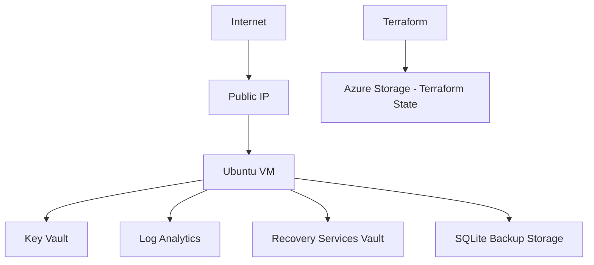

# PrivateCast Infrastructure

Terraform infrastructure for the PrivateCast project on Azure.

The goal of this repository is to keep the infrastructure simple enough for a small environment, while still following good security and operational practices.

The application itself is not deployed from this repository. This repository only contains the infrastructure layer.

## What this creates

The current design includes:

- Azure Resource Group
- Virtual Network and server subnet
- Network Security Group
- Static Public IP
- Ubuntu Linux VM
- Docker and Docker Compose through cloud-init
- System-assigned Managed Identity
- Azure Key Vault
- Azure Storage backend for Terraform state
- Log Analytics
- Azure Monitor Agent
- Data Collection Rule
- Infrastructure alerts
- Recovery Services Vault
- SQLite backup storage
- Azure budget notifications

## Architecture



## Security decisions

A few decisions in this project were made specifically for security.

SSH access is restricted to one administrator IP and password authentication is disabled.

The VM uses a system-assigned managed identity instead of storing Azure credentials on the server.

Application secrets are expected to live in Azure Key Vault and be read by the VM at runtime.

Terraform state is stored in a separate Azure Storage Account with Entra ID authentication, versioning, soft delete, and restricted network access.

Redis, SQLite, and the application services are not intended to be exposed directly to the internet.

The VM is also configured with Secure Boot, vTPM, platform-managed patching, and basic SSH hardening.

## Monitoring

The VM is connected to Azure Monitor using the Azure Monitor Agent.

The current configuration collects:

- Linux syslog
- CPU metrics
- Memory metrics
- Disk metrics
- Network metrics

Alerts are configured for:

- High CPU usage
- Low disk space
- Missing VM heartbeat

## Backup

The VM uses Azure Backup through a Recovery Services Vault.

SQLite stays local to the VM. A separate Storage Account is prepared for application-level SQLite backups.

The actual SQLite backup script will be added with the application deployment later.

## Terraform state

The state backend is bootstrapped separately:

```text
bootstrap/tfstate
```

The development environment lives in:

```text
environments/dev
```

This keeps the backend infrastructure separate from the main environment.

## Repository structure

```text
.
├── bootstrap/
│   └── tfstate/
├── environments/
│   └── dev/
├── .gitignore
└── README.md
```

## Deployment

Bootstrap the backend first:

```bash
cd bootstrap/tfstate
cp terraform.tfvars.example terraform.tfvars
terraform init
terraform plan
terraform apply
```

Then deploy the development environment:

```bash
cd ../../environments/dev
cp terraform.tfvars.example terraform.tfvars
terraform init
terraform plan
terraform apply
```

Always review the Terraform plan before applying changes.

## Validation

Useful local checks:

```bash
terraform fmt -check -recursive
```

Inside each Terraform root:

```bash
terraform init -backend=false
terraform validate
```

Security checks used during development:

```bash
trivy config . --severity HIGH,CRITICAL
gitleaks dir . --redact
```

## Notes

This project started on an Azure trial subscription, so cost was kept in mind while designing the environment.

Some parts of the infrastructure were completed as Terraform code only after the trial credit ended.

The application deployment and application CI/CD are intentionally left for a later phase.